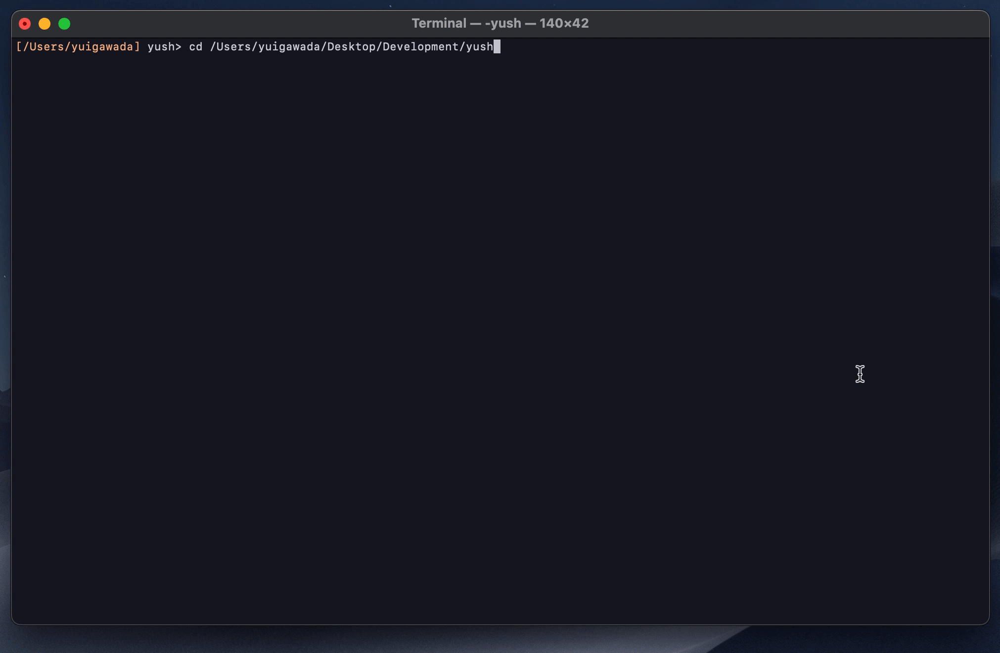

# yush: A simple shell written in OCaml

yush is a simple shell in OCaml + Lex + Yacc. Just a toy for learning 🧠

## Demo

## Getting Started

Clone this repository and run `make build`.

- `git clone git@github.com:YuigaWada/yush.git && cd yush && make -B build`

Alternatively, you can make build this project directly using [dune](https://github.com/ocaml/dune).

- `dune build`

## Details

Default $PATH includes below directories.

- /usr/local/bin
- /usr/bin
- /bin
- /usr/sbin
- /sbin

| syntax | done | description |
| :-: | :-: | - |
| cd dir | ✅ | 	Change current directory to dir.  |
| cmd1 &#124; cmd2 | ✅ | Redirect stdout of cmd1 to stdin of cmd2.  |
| cmd > file | ✅ | Redirect the standard output (stdout) of cmd to a file. |
| cmd n> file | ✅ | Redirect the standard error (stderr) of cmd to file descriptor n. |
| cmd >> file | ✅ | Append stdout of cmd to a file. |
| cmd < file | ✅ | Redirect the contents of the file to the standard input (stdin) of cmd. |
| exec n>&m | ✅ | Make file descriptor n to be a copy of file descriptor m. |
| cmd1 ; cmd2 |  | Run cmd1 then cmd2. |
| cmd1 && cmd2 |  | Run cmd2 if cmd1 is successful. |
| cmd1 &#124;&#124; cmd2 |  | Run cmd2 if cmd1 is not successful. |
| cmd & |  | Run cmd in a subshell. |

<!-- cd /Users/yuigawada/Desktop/Development/yush
ls -a
cat < yush.ml | grep let >test 2>&1
cat test
emacs yush.ml
neofetch -->